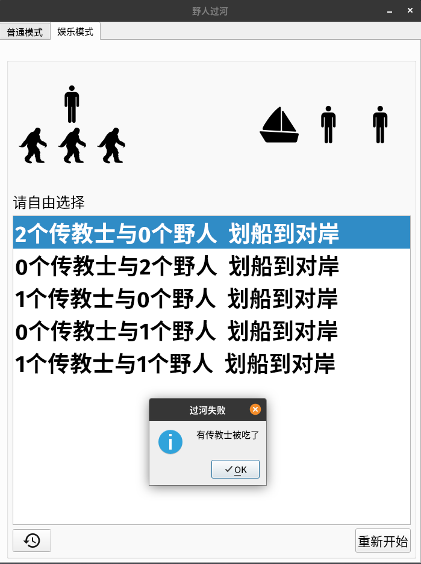
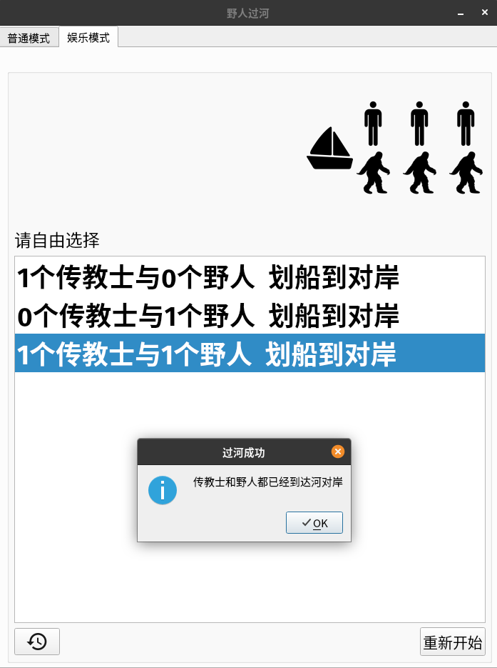

# CrossRiver
A simple QT application for The Missionaries and Cannibals Problem
## 野人过河问题
在河的左岸有三个传教士和三个野人，传教士们想用这条船将所有的成员运到河的右岸，但是受到以下条件的限制：
1. 一条船最多只能装下两个人
2. 传教士和野人都会划船
3. 在河的任何一方或者船上，如果野人的人数大于传教士的人数，那么传教士就会被野人吃掉

求出所有的过河方式
## 截图

***

***

***

